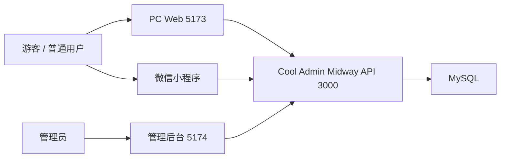
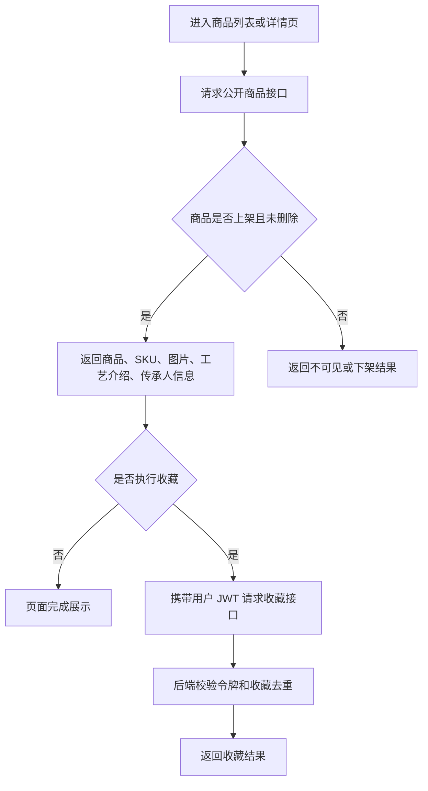
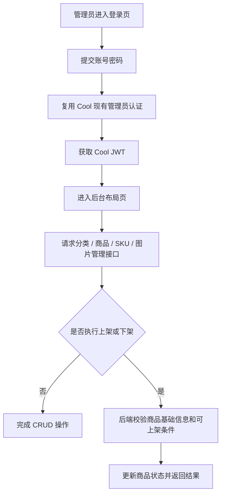

# 02 系统总体架构设计

## 1. 架构目标

第 1 组采用“一库一后端，三类前端共用接口”的最小可验收方案：

* MySQL 负责持久化分类、商品、SKU、图片、收藏和身份支撑数据
* 基于 Midway.js + Cool Admin Midway 的后端负责统一业务规则、鉴权和接口输出
* PC Web 负责商品展示与课程要求的表单页演示
* 微信小程序负责普通用户浏览与收藏
* 管理后台负责分类、商品、SKU、图片以及上架、下架管理

## 2. Cool Admin Midway 后端定位

* 后端不按“从零创建普通 Midway 项目”设计，而是基于 Cool Admin Midway 进行第 1 组业务模块二次开发。
* 优先复用 Cool 已有的管理员登录、JWT、角色权限、菜单、统一响应、基础实体和基础 CRUD。
* 第 1 组业务模块建议放入独立目录，例如 `src/modules/wudong`。
* 普通用户接口与管理接口应分开规划，例如 `controller/app` 和 `controller/admin`。
* `@CoolController` 和自动 CRUD 可用于普通增删改查，但不能代替库存、上架、收藏去重等业务校验。
* 正式开发前必须读取当前脚手架的 `README`、`package.json`、示例模块、配置、基础实体和路由规则。

## 3. 四端共用同一套后端接口

所有客户端共用同一服务端入口 `http://localhost:3000/api`，差异只体现在：

* 公开商品接口：游客可访问
* 普通用户收藏接口：要求普通用户 JWT
* 管理后台接口：要求管理员 JWT

这样可以保证：

* 商品、SKU、图片、收藏规则只有一份后端实现
* 页面联调时不需要维护多套数据接口
* 商品上下架规则可在服务端统一控制

## 4. 各端职责

| 端 | 职责 |
| --- | --- |
| MySQL | 保存核心业务数据和系统支撑数据 |
| Midway 后端 | 基于 Cool Admin Midway 提供 REST API、JWT 鉴权、输入校验、软删除过滤、统一响应 |
| PC Web | 展示商品列表与详情，并提供课程要求的新增/编辑表单联调页 |
| 微信小程序 | 面向普通用户提供商品浏览、SKU 选择和收藏 |
| 管理后台 | 面向管理员进行分类、商品、SKU、图片和上下架管理 |

## 5. 数据流说明

### 4.1 公开浏览流

* PC Web 和微信小程序访问公开接口
* 后端仅返回已上架且未软删除的商品数据
* 商品详情额外返回工艺介绍、传承人信息、SKU 列表和图片列表

### 4.2 收藏流

* 普通用户登录后携带 JWT 访问收藏接口
* 后端校验用户身份后写入或更新 `favorite`
* 收藏列表只返回未删除、商品仍可读取的收藏项

### 4.3 管理流

* 管理员登录后复用 Cool 现有认证能力获取 JWT
* 管理后台访问 `/api/admin/*` 接口
* 后端执行分类、商品、SKU、图片和商品状态管理

## 6. JWT 鉴权流程

### 5.1 普通用户鉴权

* 收藏相关接口需要普通用户 JWT
* 当前资料未明确普通用户登录方式
* 因此本轮只约束“需要用户 JWT”，具体获取方式标记为待确认

### 5.2 管理员鉴权

* 管理员通过 Cool 现有登录流程完成认证
* 后端复用 Cool 现有 JWT 机制
* 后台请求头统一携带 `Authorization: Bearer <token>`
* 后端根据角色与令牌有效性放行或拒绝

## 7. 普通接口与管理接口的区别

| 维度 | 普通接口 | 管理接口 |
| --- | --- | --- |
| 路径前缀 | `/api` | `/api/admin` |
| 数据范围 | 仅已上架、未删除商品 | 可见全部未删除商品及状态 |
| 是否要求登录 | 商品浏览否，收藏是 | 是 |
| 角色 | 游客、普通用户 | 管理员 |
| 典型能力 | 列表、详情、SKU、图片、收藏 | CRUD、库存修改、上下架、排序 |

补充说明：

* Cool 自动路由不一定天然符合课程接口路径。
* 正式开发时应先检查当前版本，再通过路由前缀或自定义 Controller 实现与课程 `/api` 路径规范兼容。

## 8. 图片存储策略

本阶段只设计图片 URL 字段，不设计对象存储：

* 主图：商品表 `cover_image`
* 详情图：图片表 `image_url`
* 后续如需接入对象存储，属于扩展项，不纳入本轮默认开发

## 9. 本地开发端口

* 后端：`3000`
* PC Web：`5173`
* 管理后台：`5174`
* 微信小程序：微信开发者工具本地运行，调用后端 `3000`

## 10. 跨域处理思路

* Cool Admin Midway 后端统一开启 CORS
* 允许来自 `http://localhost:5173` 和 `http://localhost:5174` 的开发请求
* 允许携带 `Authorization` 请求头
* 微信小程序本地调试依赖开发者工具的本地配置，不通过浏览器 CORS 处理

## 11. 小程序请求 localhost 的注意事项

在微信开发者工具本地调试时：

* 使用 `wx.request`
* 后端地址可写为 `http://localhost:3000`
* 需要开启“不校验合法域名、web-view、TLS 版本以及 HTTPS 证书”
* 真机测试不能直接使用电脑 `localhost`
* 真机联调时需要改用局域网 IP、穿透地址或已部署环境

## 12. Redis、Swagger 与 Docker 的定位

### 12.1 Redis

* Redis 可用于商品缓存、Token 辅助管理、限流和防重复操作。
* 核心商品 CRUD 必须在 Redis 未接入时也能运行。
* 收藏去重必须由数据库唯一约束兜底，不能只依赖 Redis。

### 12.2 Swagger / OpenAPI

* 后端后续应生成真实 Swagger / OpenAPI 接口文档。
* Swagger 不能代替 Postman 测试，也不能代替真实数据库联调。

### 12.3 Docker

* Docker 是课程整体技术栈和后期部署目标，不是当前文档阶段任务。
* 当前不需要在 Docker 中安装 Codex、Gemini CLI 或 Claude Code。
* 后期再单独规划后端 Dockerfile、MySQL、Redis、Docker Compose、数据卷、环境变量和容器联网验证。

## 13. 系统总体架构图

## 14. 普通用户请求流程图

## 15. 管理员登录和管理流程图

## 16. 待确认事项

* 普通用户 JWT 的签发入口和登录方式
* MySQL 版本与字符集是否有课程统一要求
* 是否需要单独的文件上传服务；当前仅按 URL 字段设计
* Cool Admin Midway 当前实际版本中的模块目录、基础实体和课程接口兼容方式
