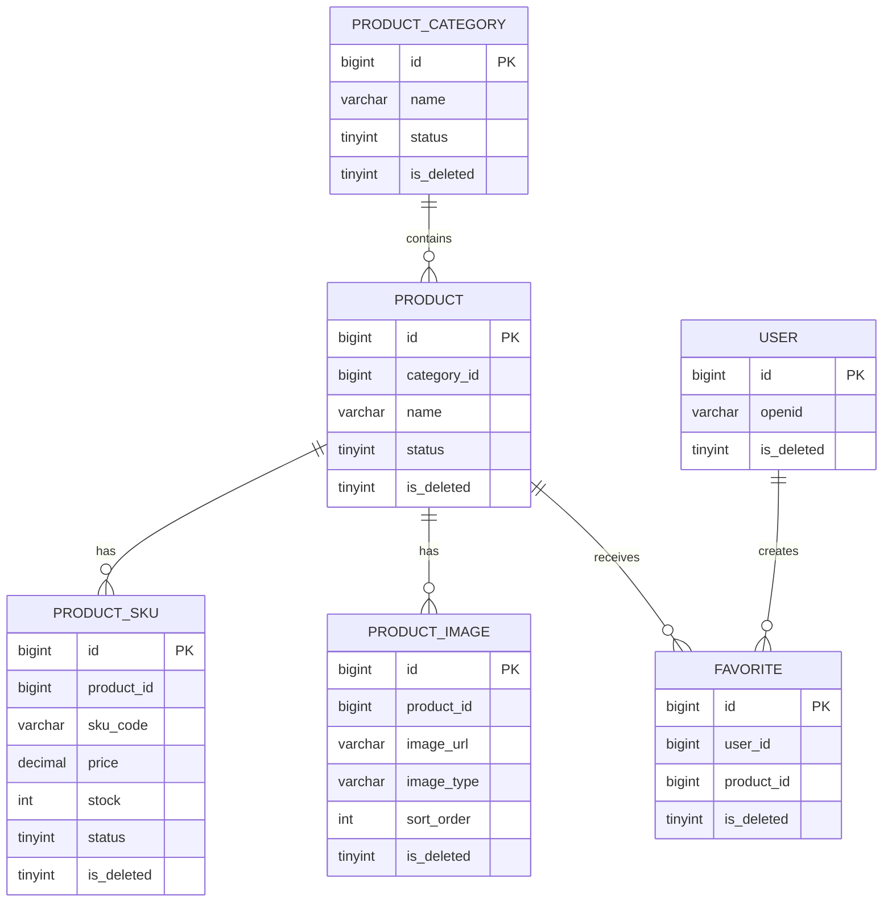

# 03 数据库设计

## 1. 设计范围

本设计面向第 1 组“衣·非遗商品模块”，仅输出表结构设计，不生成 `init.sql`，不初始化数据库。

## 2. 设计约定

### 2.1 核心业务表

* `product_category`
* `product`
* `product_sku`
* `product_image`
* `favorite`

### 2.2 系统支撑表

* `user`
* Cool 脚手架现有管理员、角色、权限、菜单等基础表

### 2.3 公共字段

所有业务表统一考虑以下公共字段：

* `id`
* `created_at`
* `updated_at`
* `is_deleted`

### 2.4 统一说明

* 主键统一使用 `BIGINT UNSIGNED`
* 时间统一使用 `DATETIME`
* 软删除统一使用 `is_deleted`，`0` 表示未删除，`1` 表示已删除
* 商品上架状态统一使用 `status`，`0` 表示下架，`1` 表示上架
* SKU 启用状态统一使用 `status`，`0` 表示停用，`1` 表示启用
* 管理员、角色、权限和菜单基础表优先复用 Cool Admin Midway 当前版本，不在本轮单独建模

## 3. 表设计

## 3.1 商品分类表

* 中文名称：商品分类表
* 英文表名：`product_category`
* 用途：维护商品所属分类，并为列表筛选和后台管理提供基础数据

| 字段名 | 数据类型 | 是否为空 | 默认值 | 主键 | 唯一约束 | 索引 | 外键或逻辑关联 | 字段说明 |
| --- | --- | --- | --- | --- | --- | --- | --- | --- |
| id | BIGINT UNSIGNED | 否 | 自增 | 是 | 否 | 主键索引 | 无 | 分类主键 |
| name | VARCHAR(100) | 否 | 无 | 否 | 否 | 普通索引 | 与商品分类名称逻辑关联 | 分类名称，未删除数据中应唯一 |
| description | VARCHAR(255) | 是 | NULL | 否 | 否 | 否 | 无 | 分类说明 |
| sort_order | INT UNSIGNED | 否 | 0 | 否 | 否 | 普通索引 | 无 | 分类排序值，越小越靠前 |
| status | TINYINT(1) | 否 | 1 | 否 | 否 | 普通索引 | 无 | 分类启用状态，1 启用，0 停用 |
| created_at | DATETIME | 否 | CURRENT_TIMESTAMP | 否 | 否 | 否 | 无 | 创建时间 |
| updated_at | DATETIME | 否 | CURRENT_TIMESTAMP | 否 | 否 | 否 | 无 | 更新时间 |
| is_deleted | TINYINT(1) | 否 | 0 | 否 | 否 | 普通索引 | 无 | 软删除标记 |

补充说明：

* 分类名称是否需要数据库级唯一约束，受软删除策略影响，当前采用“未删除数据中逻辑唯一”的方案
* 本轮按单级分类设计，不增加 `parent_id`

## 3.2 商品表

* 中文名称：商品表
* 英文表名：`product`
* 用途：存储商品主体信息、工艺介绍、传承人信息和上架状态

| 字段名 | 数据类型 | 是否为空 | 默认值 | 主键 | 唯一约束 | 索引 | 外键或逻辑关联 | 字段说明 |
| --- | --- | --- | --- | --- | --- | --- | --- | --- |
| id | BIGINT UNSIGNED | 否 | 自增 | 是 | 否 | 主键索引 | 无 | 商品主键 |
| category_id | BIGINT UNSIGNED | 否 | 无 | 否 | 否 | 普通索引 | 逻辑关联 `product_category.id` | 所属分类 |
| name | VARCHAR(150) | 否 | 无 | 否 | 否 | 普通索引 | 无 | 商品名称 |
| subtitle | VARCHAR(255) | 是 | NULL | 否 | 否 | 否 | 无 | 商品副标题 |
| description | TEXT | 是 | NULL | 否 | 否 | 否 | 无 | 商品详情描述 |
| craft_intro | TEXT | 否 | 无 | 否 | 否 | 否 | 无 | 非遗工艺介绍 |
| inheritor_name | VARCHAR(100) | 否 | 无 | 否 | 否 | 否 | 无 | 传承人姓名 |
| inheritor_intro | TEXT | 否 | 无 | 否 | 否 | 否 | 无 | 传承人介绍 |
| cover_image | VARCHAR(500) | 否 | 无 | 否 | 否 | 否 | 无 | 商品主图 URL |
| status | TINYINT(1) | 否 | 0 | 否 | 否 | 普通索引 | 无 | 商品上架状态，0 下架，1 上架 |
| published_at | DATETIME | 是 | NULL | 否 | 否 | 否 | 无 | 最近一次上架时间 |
| created_at | DATETIME | 否 | CURRENT_TIMESTAMP | 否 | 否 | 否 | 无 | 创建时间 |
| updated_at | DATETIME | 否 | CURRENT_TIMESTAMP | 否 | 否 | 否 | 无 | 更新时间 |
| is_deleted | TINYINT(1) | 否 | 0 | 否 | 否 | 普通索引 | 无 | 软删除标记 |

补充说明：

* 商品表不保存库存字段
* 商品是否售罄由其启用且未删除的 SKU 库存计算得出

## 3.3 商品 SKU 表

* 中文名称：商品 SKU 表
* 英文表名：`product_sku`
* 用途：存储同一商品下多个规格的价格、库存和状态

| 字段名 | 数据类型 | 是否为空 | 默认值 | 主键 | 唯一约束 | 索引 | 外键或逻辑关联 | 字段说明 |
| --- | --- | --- | --- | --- | --- | --- | --- | --- |
| id | BIGINT UNSIGNED | 否 | 自增 | 是 | 否 | 主键索引 | 无 | SKU 主键 |
| product_id | BIGINT UNSIGNED | 否 | 无 | 否 | 否 | 普通索引 | 逻辑关联 `product.id` | 所属商品 |
| sku_code | VARCHAR(64) | 否 | 无 | 否 | 是 | 唯一索引 | 无 | SKU 编码，全局唯一 |
| specification | VARCHAR(255) | 否 | 无 | 否 | 否 | 否 | 无 | 规格描述，如“银饰 / 口径 58mm” |
| price | DECIMAL(10,2) | 否 | 0.00 | 否 | 否 | 普通索引 | 无 | 售价 |
| stock | INT UNSIGNED | 否 | 0 | 否 | 否 | 普通索引 | 无 | 库存数量，不允许负数 |
| status | TINYINT(1) | 否 | 1 | 否 | 否 | 普通索引 | 无 | SKU 启用状态，0 停用，1 启用 |
| created_at | DATETIME | 否 | CURRENT_TIMESTAMP | 否 | 否 | 否 | 无 | 创建时间 |
| updated_at | DATETIME | 否 | CURRENT_TIMESTAMP | 否 | 否 | 否 | 无 | 更新时间 |
| is_deleted | TINYINT(1) | 否 | 0 | 否 | 否 | 普通索引 | 无 | 软删除标记 |

补充说明：

* 同一商品可以存在多个 SKU
* 列表、详情接口需返回每个 SKU 的 `soldOut` 计算结果，规则为 `stock = 0`

## 3.4 商品图片表

* 中文名称：商品图片表
* 英文表名：`product_image`
* 用途：维护商品详情图、展示图和排序信息

| 字段名 | 数据类型 | 是否为空 | 默认值 | 主键 | 唯一约束 | 索引 | 外键或逻辑关联 | 字段说明 |
| --- | --- | --- | --- | --- | --- | --- | --- | --- |
| id | BIGINT UNSIGNED | 否 | 自增 | 是 | 否 | 主键索引 | 无 | 图片主键 |
| product_id | BIGINT UNSIGNED | 否 | 无 | 否 | 否 | 普通索引 | 逻辑关联 `product.id` | 所属商品 |
| image_url | VARCHAR(500) | 否 | 无 | 否 | 否 | 否 | 无 | 图片 URL |
| image_type | VARCHAR(30) | 否 | `detail` | 否 | 否 | 普通索引 | 无 | 图片类型，如 `detail`、`gallery` |
| sort_order | INT UNSIGNED | 否 | 0 | 否 | 否 | 普通索引 | 无 | 图片排序值 |
| created_at | DATETIME | 否 | CURRENT_TIMESTAMP | 否 | 否 | 否 | 无 | 创建时间 |
| updated_at | DATETIME | 否 | CURRENT_TIMESTAMP | 否 | 否 | 否 | 无 | 更新时间 |
| is_deleted | TINYINT(1) | 否 | 0 | 否 | 否 | 普通索引 | 无 | 软删除标记 |

## 3.5 收藏关系表

* 中文名称：收藏关系表
* 英文表名：`favorite`
* 用途：记录普通用户对商品的收藏关系

| 字段名 | 数据类型 | 是否为空 | 默认值 | 主键 | 唯一约束 | 索引 | 外键或逻辑关联 | 字段说明 |
| --- | --- | --- | --- | --- | --- | --- | --- | --- |
| id | BIGINT UNSIGNED | 否 | 自增 | 是 | 否 | 主键索引 | 无 | 收藏主键 |
| user_id | BIGINT UNSIGNED | 否 | 无 | 否 | 否 | 普通索引 | 逻辑关联 `user.id` | 收藏用户 |
| product_id | BIGINT UNSIGNED | 否 | 无 | 否 | 否 | 普通索引 | 逻辑关联 `product.id` | 被收藏商品 |
| created_at | DATETIME | 否 | CURRENT_TIMESTAMP | 否 | 否 | 否 | 无 | 创建时间 |
| updated_at | DATETIME | 否 | CURRENT_TIMESTAMP | 否 | 否 | 否 | 无 | 更新时间 |
| is_deleted | TINYINT(1) | 否 | 0 | 否 | 否 | 普通索引 | 无 | 取消收藏标记，0 已收藏，1 已取消 |

唯一约束：

* `UNIQUE(user_id, product_id)`

补充说明：

* 取消收藏时，不删除记录，改为 `is_deleted = 1`
* 再次收藏时，优先恢复原记录，而不是插入第二条记录
* 这样可以同时满足软删除和收藏去重要求

## 3.6 普通用户表

* 中文名称：普通用户表
* 英文表名：`user`
* 用途：作为收藏功能和普通用户 JWT 的最小系统支撑表

| 字段名 | 数据类型 | 是否为空 | 默认值 | 主键 | 唯一约束 | 索引 | 外键或逻辑关联 | 字段说明 |
| --- | --- | --- | --- | --- | --- | --- | --- | --- |
| id | BIGINT UNSIGNED | 否 | 自增 | 是 | 否 | 主键索引 | 无 | 用户主键 |
| openid | VARCHAR(64) | 否 | 无 | 否 | 是 | 唯一索引 | 无 | 小程序用户唯一标识，当前作为最小方案设计 |
| nickname | VARCHAR(100) | 是 | NULL | 否 | 否 | 否 | 无 | 用户昵称 |
| avatar_url | VARCHAR(500) | 是 | NULL | 否 | 否 | 否 | 无 | 用户头像 URL |
| last_login_at | DATETIME | 是 | NULL | 否 | 否 | 否 | 无 | 最近登录时间 |
| created_at | DATETIME | 否 | CURRENT_TIMESTAMP | 否 | 否 | 否 | 无 | 创建时间 |
| updated_at | DATETIME | 否 | CURRENT_TIMESTAMP | 否 | 否 | 否 | 无 | 更新时间 |
| is_deleted | TINYINT(1) | 否 | 0 | 否 | 否 | 普通索引 | 无 | 软删除标记 |

补充说明：

* `user` 为系统支撑表，不属于第 1 组核心业务表
* 普通用户登录流程本轮未展开，只保留最小身份承载结构

## 3.7 Cool 管理员与权限基础表复用说明

* 第 1 组不单独设计 `admin_user`、角色表、权限表和菜单表。
* 正式开发时必须复用 Cool Admin Midway 当前版本已有管理员与权限基础表。
* 实际表名、字段和关联关系以当前脚手架源码为准。

## 4. 关系说明

### 4.1 为什么库存放在 SKU 表

* 同一商品可能有多个规格，每个规格价格和库存都可能不同
* 如果把库存放在商品表，会丢失规格维度
* 因此库存必须放在 `product_sku.stock`

### 4.2 商品与 SKU 的一对多关系

* 一个商品对应多个 SKU
* 一个 SKU 只属于一个商品
* 删除商品时，相关 SKU 应一并视为不可用；实现上采用软删除或联动状态控制

### 4.3 商品与图片的一对多关系

* 一个商品可以有一张主图和多张详情图
* 主图保存在 `product.cover_image`
* 其余展示图保存在 `product_image`

### 4.4 商品与收藏的关系

* 一个商品可被多个用户收藏
* 一个用户可收藏多个商品
* 通过 `favorite` 形成多对多关系

### 4.5 售罄状态如何计算

* 单个 SKU 的售罄状态：`stock = 0`
* 商品整体售罄状态：该商品所有启用且未删除 SKU 的库存都为 `0`
* 商品表不单独保存售罄字段，避免冗余与不一致

### 4.6 上架、下架状态如何表示

* 商品上架状态存放在 `product.status`
* `1` 表示已上架
* `0` 表示已下架
* `published_at` 记录最近一次上架时间

### 4.7 软删除如何实现

* 所有业务表统一使用 `is_deleted`
* 软删除只更新标记，不做物理删除
* 收藏取消操作也复用 `is_deleted`

### 4.8 查询时如何过滤软删除数据

* 默认查询条件统一加上 `is_deleted = 0`
* 公开商品接口还需额外加上 `status = 1`
* 管理端查询默认只看未删除数据，但可以根据后续需要扩展回收站能力

### 4.9 Entity 与 `backend/sql/init.sql` 同步方案

* 课程要求的 `backend/sql/init.sql` 必须与 Cool Entity 最终保持同步。
* 不允许存在一套 Entity 和另一套相互冲突的 SQL 结构。
* 本轮只输出同步原则，不创建 `init.sql`。

## 5. ER 图

## 6. 待确认事项

* 分类是否需要多级结构
* `user` 是否最终采用 `openid`，还是需要课程统一的测试账号体系
* 图片类型枚举是否还需细分为主图、轮播图、详情图等更多值
* Cool Admin Midway 当前版本管理员与权限基础表的实际命名
