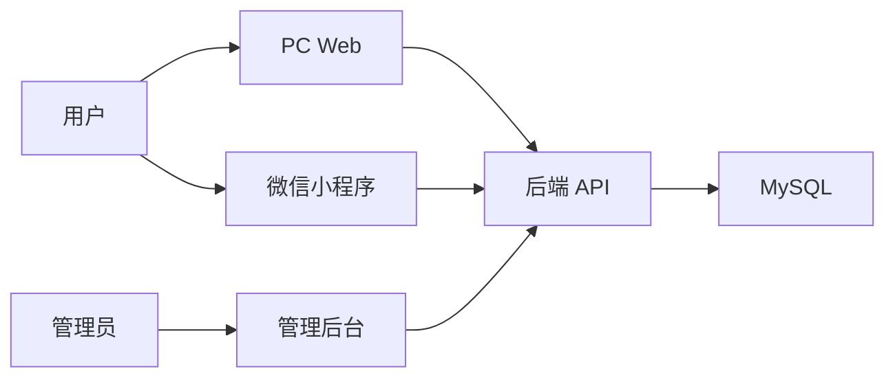

# CSDN 系列文章框架

## 1. 系列定位

这组文章不写成“代码堆砌记录”，而是写成“用软件工程思想完成一个完整项目”的实战系列。

项目基础可直接结合当前仓库展开：

- `backend`：后端服务
- `pc-web`：PC 端用户界面
- `admin-web`：管理后台
- `miniapp`：微信小程序
- `docs`：需求、架构、数据库、接口设计文档

建议系列总标题：

`从 0 到 1 搭建一个四端项目：用软件工程思想完成非遗文旅电商系统`

副标题可选：

`不是只会写代码，而是学会按需求、架构、模块、联调、验收的顺序把项目真正落地`

---

## 2. 写作总风格

### 2.1 语言风格

- 句子短一点
- 少讲空话，多讲“为什么这样做”
- 一段只讲一个重点
- 尽量把专业词翻译成人话

### 2.2 视觉风格

建议走“轻松卡通 + 工程流程图”路线：

- 角色：需求小人、后端小人、前端小人、测试小人
- 模块：用小积木、小工厂、小仓库表示
- 流程：用箭头和分步骤图表示
- 结果：用页面截图做收尾

### 2.3 配图原则

能图示就不写大段文字，优先放这几类图：

- 系统架构图
- 开发流程图
- 数据流转图
- 页面截图
- 表结构关系图

---

## 3. 系列文章建议目录

建议先写 6 篇，既完整，又不会太散。

### 第 1 篇

`不是先写代码，而是先搭框架：用软件工程思想启动项目`

核心内容：

- 为什么项目不能一上来就开写
- 如何先做需求拆分
- 如何确定技术栈和系统边界
- 如何把项目拆成后端、PC 端、后台、小程序四部分
- 如何先搭一个“能跑起来”的最小框架

建议配图：

- 一张“从想法到项目”的卡通流程图
- 一张四端系统架构图

### 第 2 篇

`需求分析怎么做：先把角色、功能和边界讲清楚`

核心内容：

- 游客、普通用户、管理员分别能做什么
- 哪些功能本期做，哪些功能暂时不做
- 为什么需求边界决定开发难度

建议配图：

- 用户角色关系图
- 功能模块脑图

### 第 3 篇

`系统架构设计怎么做：为什么这个项目要做成四端联动`

核心内容：

- 四端分别负责什么
- 为什么三端前端共用一套后端接口
- 为什么要先保证接口统一，再考虑页面细节

建议配图：

- 总体架构图
- 用户请求流转图

### 第 4 篇

`数据库和接口设计怎么落地：先把数据想清楚，后面才不会乱`

核心内容：

- 商品、分类、SKU、收藏等表怎么设计
- 表之间是什么关系
- 接口为什么要按角色区分
- 为什么接口命名和返回结构要统一

建议配图：

- ER 图
- 接口分层图

### 第 5 篇

`前后端分模块开发：四个子项目是怎么一步步搭起来的`

核心内容：

- 后端模块如何拆分
- PC Web 做了什么
- 管理后台做了什么
- 小程序做了什么
- 如何保证大家并行开发不互相拖累

建议配图：

- 仓库目录结构图
- 模块职责分工图
- 页面截图

### 第 6 篇

`联调、验收与交付：一个项目能跑起来，不代表它真的完成了`

核心内容：

- 联调顺序怎么安排
- 如何做接口验证
- 如何做页面验收
- 如何整理交接文档
- 一个课程项目怎样写出“像正式项目”的收尾

建议配图：

- 联调流程图
- 验收清单图
- 最终运行截图

---

## 4. 每篇文章的统一结构

后面每篇都可以套这个模板，写起来会很快。

### 文章模板

1. 开头一句话

用一个很短的问题切入，比如：

`为什么很多同学项目做到一半就乱了？因为一开始就少了“软件工程这一步”。`

2. 这篇要解决什么问题

直接告诉读者本文重点，不绕弯。

3. 项目里的真实做法

结合你这个项目的实际目录、模块、接口、页面来讲。

4. 一张图讲明白

尽量每篇至少有 1 张主图。

5. 最后做个小总结

用 3 句话以内收尾。

---

## 5. 第 1 篇详细框架

题目建议：

`不是先写代码，而是先搭框架：用软件工程思想启动一个四端项目`

### 5.1 开头

可以这样起：

`很多同学做项目时，第一反应就是建表、写接口、画页面。但真正能把项目做顺的人，第一步往往不是写代码，而是先搭框架。这里说的框架，不只是代码框架，更是需求框架、模块框架和开发流程框架。`

### 5.2 第一部分：为什么不能一上来就写代码

可讲 3 点：

- 需求没定，写着写着会返工
- 模块没拆，团队协作会互相卡住
- 接口没统一，后面联调会很痛苦

### 5.3 第二部分：先做需求拆分

结合当前项目可写：

- 项目目标：做一个非遗文旅商品展示与管理系统
- 用户角色：游客、登录用户、管理员
- 功能范围：商品浏览、商品详情、收藏、后台管理

### 5.4 第三部分：再做系统拆分

结合当前仓库可写：

- `backend` 负责统一业务能力
- `pc-web` 负责 PC 端展示
- `admin-web` 负责运营管理
- `miniapp` 负责小程序端浏览与收藏

### 5.5 第四部分：最后才是代码框架

这部分强调“最小可运行”：

- 先让后端跑起来
- 再让前端页面跑起来
- 再把数据库和接口接上
- 最后做联调和验收

### 5.6 结尾

可以这样收：

`软件工程的价值，不是把流程写得很复杂，而是帮我们少走弯路。项目真正的起点，不是第一行代码，而是第一张清晰的项目框架图。`

---

## 6. 第一篇配图方案

### 图 1：项目启动流程图

适合画成卡通流程：

`想法 -> 需求分析 -> 架构设计 -> 模块拆分 -> 环境搭建 -> 编码开发 -> 联调验收`

### 图 2：四端架构图

可直接用这种表达：

### 图 3：项目目录图

可展示：

- `backend/`
- `pc-web/`
- `admin-web/`
- `miniapp/`
- `docs/`

---

## 7. 当前项目可直接使用的素材

你这个仓库里已经有一些很适合后面发文时插入的截图：

- 首页相关图：`desktop-home.png`、`desktop-home-v4.png`
- 详情页相关图：`detail-final.png`、`detail-final-v2.png`
- 收藏页相关图：`favorites-final.png`、`favorites-mobile-final.png`

用法建议：

- 第 1 篇先以流程图和架构图为主
- 第 5 篇和第 6 篇再插页面截图，效果最好

---

## 8. 后续写作顺序建议

建议我们按这个节奏继续：

1. 先把第 1 篇完整写出来
2. 再写第 2、3 篇，把“需求”和“架构”连起来
3. 再写第 4、5、6 篇，形成完整系列

如果想更像 CSDN 爆款一点，每篇标题都可以带一个“问题句”：

- 为什么项目一开始不能急着写代码？
- 为什么四端项目一定要先做架构设计？
- 为什么数据库设计能决定后面的开发效率？

---

## 9. 一句话总结

这套系列的核心不是“展示我写了多少代码”，而是“把一个项目从想法到落地的工程过程讲明白”。
